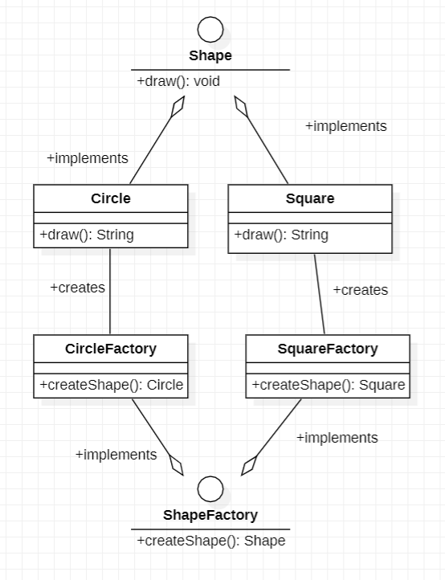

# Devoir DESIGN PATTERN

## Table des matières

- [Devoir DESIGN PATTERN](#devoir-design-pattern)
  - [Table des matières](#table-des-matières)
  - [Lancer le Projet](#lancer-le-projet)
  - [Questions :](#questions-)
    - [1 - Quel(s) avantage(s) procure(nt) le fait de programmer vers une interface et non vers une implémentation ?](#1---quels-avantages-procurent-le-fait-de-programmer-vers-une-interface-et-non-vers-une-implémentation-)
    - [2 - Pourquoi, de manière générale, vaut-il mieux préférer la composition à l’héritage ?](#2---pourquoi-de-manière-générale-vaut-il-mieux-préférer-la-composition-à-lhéritage-)
    - [3 - En programmation orienté objet, qu’est ce qu’une interface ? Remarque : on ne parle pas ici du construct PHP `interface`.](#3---en-programmation-orienté-objet-quest-ce-quune-interface--remarque--on-ne-parle-pas-ici-du-construct-php-interface)
- [Design Pattern **Factory**](#design-pattern-factory)
  - [Contexte](#contexte)
  - [Avantages et Inconvénients](#avantages-et-inconvénients)
    - [Avantages](#avantages)
    - [Inconvénients](#inconvénients)
  - [Conclusion](#conclusion)
    - [Implémenter le design pattern](#implémenter-le-design-pattern)
    - [Diagramme de classes UML](#diagramme-de-classes-uml)

## Lancer le Projet

Pour exécuter la démo, suivez ces étapes :

1. Assurez-vous d'avoir [XAMPP](https://www.apachefriends.org/fr/index.html) installé sur votre machine.
2. Clonez ce repository : `git clone https://github.com/FLXwkg/FactoryDesignPattern.git`.
3. Démarrez XAMPP et lancez le serveur Apache.
4. Placez le projet dans le répertoire htdocs/php.
5. Accédez au projet via votre navigateur en utilisant l'URL appropriée (par exemple, http://localhost/php).

## Questions :

### 1 - Quel(s) avantage(s) procure(nt) le fait de programmer vers une interface et non vers une implémentation ?

Les avantages de programmer vers une interface et non vers une implémentation sont : 

- **La flexibilité**, car cela permet au client de manipuler les mêmes interfaces (donc méthodes) en obtenant des comportements différents selon les besoins de l'utilisateur.

- **L’extensibilité**, car cela permet d’introduire de nouvelles implémentations de l’interface sans modifier le code existant. Cela facilite l’ajout de nouvelles fonctionnalités ou même la modification du comportement sans avoir d’impact sur le reste du système.

### 2 - Pourquoi, de manière générale, vaut-il mieux préférer la composition à l’héritage ?

Préférer la composition (ou agrégation) à l'héritage est généralement recommandé pour une plus grande flexibilité. La composition, basée sur la relation “a-un”, permet des modifications de comportement à l'exécution, offrant une adaptabilité dynamique.
En revanche, l'héritage (relation “est-un” ou “se comporte comme”) nécessite des modifications avant exécution, générant un couplage fort et des changements complexes. 

La composition maintient l'encapsulation, évitant les détails internes partagés, alors que l'héritage expose l'interface et l'implémentation, entraînant une non-encapsulation.

### 3 - En programmation orienté objet, qu’est ce qu’une interface ? Remarque : on ne parle pas ici du construct PHP `interface`.

En POO, une interface est un ensemble de méthodes que les classes qui implémentent cette interface doivent fournir. 
Elle définit un ensemble de comportements attendus, et toute classe qui implémente cette interface doit en fournir une concrète pour chacune de ces méthodes.

# Design Pattern **Factory**

Le design pattern Factory est un patron de conception **créationnel** qui offre une solution structurée à la création d'objets sans spécifier explicitement leur classe. Il permet de déléguer la responsabilité de la création d'objets à des classes spécifiques, offrant ainsi une grande *flexibilité* dans la création d'instances.

Le design pattern Factory comporte *deux* types principaux :

*Simple Factory :* Une classe, souvent appelée "Factory", est responsable de créer des objets sans exposer la logique de création au client.

*Factory Method :* Définit une interface pour la création d'un objet, mais délègue le choix de sa classe concrète aux sous-classes, permettant ainsi une personnalisation tout en respectant un certain cadre.

## Contexte

Le design pattern Factory trouve une application pertinente dans la modélisation de scénarios où la création d'objets peut varier en fonction des besoins. Prenons l'exemple d'un système de gestion de commandes dans un café. Selon les choix du client, différents types de cafés doivent être créés, chacun nécessitant une configuration spécifique. La Factory, dans ce contexte, permet de créer ces variations de cafés de manière centralisée, isolant le client des détails spécifiques de création.

## Avantages et Inconvénients

### Avantages

- **Abstraction de la Création :** Le client demande la création d'un objet via la Factory sans se soucier de sa classe concrète, offrant une abstraction efficace.
  
- **Flexibilité Évolutive :** Permet d'ajouter de nouveaux types d'objets sans modifier le code client existant, favorisant l'extension sans la nécessité de créer de nouvelles sous-classes.

- **Configuration Centralisée :** La logique de création est regroupée dans la Factory, simplifiant la maintenance et la gestion des différentes configurations.

### Inconvénients

- **Manque de Détails Dynamiques :** Contrairement au Decorator, la Factory ne permet pas de modifier dynamiquement le comportement des objets existants.

- **Complexité Potentielle :** La mise en place d'une Factory peut introduire une complexité initiale dans la gestion des différentes classes de produits.

- **Moins de Dynamisme :** Moins adapté aux scénarios où les comportements doivent être modifiés dynamiquement au cours de l'exécution.

## Conclusion

En conclusion, le design pattern Factory est un outil puissant pour la création d'objets, offrant une séparation claire entre le code client et les détails de création. Il s'avère particulièrement utile dans des contextes où la création d'objets peut varier de manière significative, offrant ainsi une solution élégante et flexible à ce type de problème.

### Implémenter le design pattern 

Le code source est disponible dans le fichier [index.php](index.php).

### Diagramme de classes UML
Il représente le Design Pattern *Factory* et non le *Simple Factory*.

